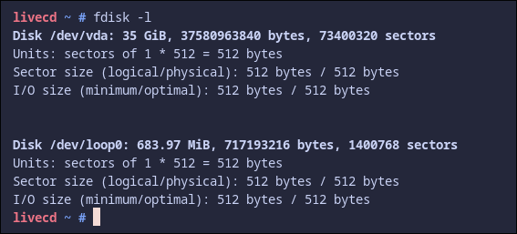
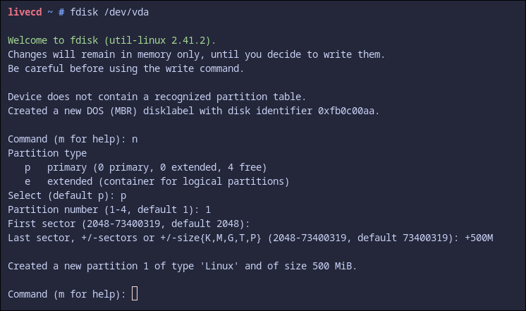
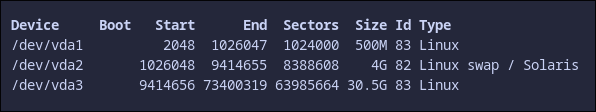
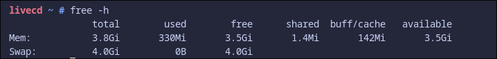

## Create Disks

So now we need to have ```three``` partitions:

- ```boot```
: This will be about 500MB.

- ```swap```
: This is extra ram for when we build the distro. Should be the same size as our RAM allocation for the environment, so i'll make this 4GB.
- ```/```
: This is the root. This will just be the remaining space

First you'll need to know what your disk is called. To find this we use ```fdisk```




Now theres a syntax to fdisk that you'll want to get familiar with. 
To add a partition, type ```fdisk /dev/sda```
The series of commands is so:
- ```n```: Creates a new partition
- ```p```: Is a primary partition
- ```1```: Set partition number
- The next step assigns the first sector. This is the starting point of our partition and we can just press ```enter``` to select the default.
- The next part gives us the option to resize in a handy way. We dont beent to calculate the exact bytes needed to make 500MB forom sector 2048 (it's XXX, but that's besides the point). We just need to type ```+500M``` to make the partition 500MB total.



You'll need to change the drive type of the ```swap``` to Linux swap / Solaris aswell.
- ```t```: Change drive type
- Select which drive is the swap. For me its ```2```.
- If unsure, press ```L``` to list all options. The one you want is ```82```, so type that.

Afterwards when you press ```p``` to list all of partitions, you should see this

Now press ```w``` to write all of the partitions and ```q``` to exit.



## Formatting and Mounting Disks
Once created, it's a good idea to format the drives and initialise the swap. 

We can use ```mkfs.ext4``` to achieve the disk formatting and ```mkswap``` to enable swap.

```sh
mkfs.ext4 /dev/sda1 # This will format our `boot` partition
mkswap /dev/sda2 # This creates our swap
mkfs.ext4 /dev/sda3 # This formats our root partition
```

We will need to export the variable for LFS

```sh
export LFS=/mnt/lfs # Use echo $LFS to check, should say '/mnt'
```

Also set the file mode creation mask (umask) to ```021```. This controls default permissions for new files/directories by removing bits from the system's base permissions (666 for files, 777 for directories)

```sh
umask 021
```

Now everything needs to be mounted

```sh
mkdir -pv $LFS                      # Create our root ('/') directory
mount -v -t ext4 /dev/sda3 $LFS     # Mount the / partition

chown user:user $LFS                # Give LFS user permissions
chmod 755 $LFS                      # Give the directory permissions

swapon /dev/sda2                    # Enables the swap 
```

This should just work, but we'll need to check if the swap partition is active.

We can use ```free -h``` to find this out.



