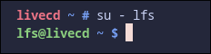
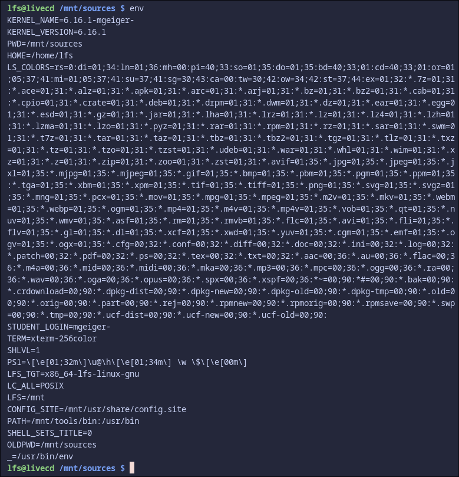

- [Create Directory Layout](#create-directory-layout)

- [Adding the LFS User](#adding-the-lfs-user)

- [Logging In](#logging-in)

- [Activate Environment](#activate-environment)

- [Configure Student-Specific Settings](#configure-student-specific-settings)

  

Great, you've made it this far. Now we get to start working on the actual task.

We will need to export the variable for LFS.  

We will need this because we will be referencing it hundreds of times and its just easier this way

Now we need to create the source directory

```sh
mkdir -v $LFS/sources # Creates /mnt/lfs/sources

  

chmod -v a+wt $LFS/sources

# a+w = all users can write (needed because we'll build as different users)

# t = "sticky bit" - users can only delete their own files (security measure)
```

## Pull Packages

There is a list of packages given in the LFS book. you may need to double check the sources because some servers may be down. I have included the ```wget-list.txt``` to add with this command

```sh
wget --input-file=wget-list.txt --continue --directory-prefix=$LFS/sources
```

This should download all of the packages to ```LFS/sources```. If any are missing, you'll need to get them manually. After this has finished, changed the permissions to include the user

```sh
sudo chown -R user:user $LFS/sources
```

## Create Directory Layout

We need to create a proper layout in our newly created space.

The directories we need:

- ```/etc``` = system configuration files will go here
- ```/var``` = variable data (logs, caches, etc.)
- ```/usr/bin``` = user programs and commands
- ```/usr/lib``` = shared libraries
- ```/usr/sbin``` = system administration binaries  

symbolic links: Modern Linux systems are moving toward a "merged /usr" layout where:

- /bin → /usr/bin (symlink)
- /lib → /usr/lib (symlink)
- /sbin → /usr/sbin (symlink)


Old programs expect /bin/bash, but the actual file lives in /usr/bin/bash. The symlinks make both paths work.

The lib64 directory:

- Only created on 64-bit systems (x86_64)
- Some programs specifically look for 64-bit libraries in /lib64
- This ensures compatibility with software that has hardcoded paths  

Here's a script to do this:

```sh
mkdir -pv $LFS/{etc,var} $LFS/usr/{bin,lib,sbin}

for i in bin lib sbin; do
  ln -sv usr/$i $LFS/$i
done

case $(uname -m) in
  x86_64) mkdir -pv $LFS/lib64 ;;
esac
```

And make a tools folder

```sh
mkdir -pv $LFS/tools
```

## Adding the LFS User

Why create a user if we are root and can just do it from here. There are a few reasons:

- ```Isolation```: The LFS user has no special privileges and can't accidentally damage the host system
- ```Clean environment```: The LFS user starts with a minimal environment - no weird environment variables from root that could break the build
- ```Prevents mistakes```: If you run a command like rm -rf /bin while logged in as root, you could destroy the host. As the lfs user, you can only affect the /mnt directory you own.
- ```Follows LFS best practices```: The book is designed around this workflow

  
Here's a script to help with this:

```sh
groupadd lfs
useradd -s /bin/bash -g lfs -m -k /dev/null lfs
passwd lfs

chown -v lfs $LFS/{usr{,/*},lib,var,etc,bin,sbin,sources,tools}
case $(uname -m) in
  x86_64) chown -v lfs $LFS/lib64 ;;
esac
```

Breaking down the ```useradd``` command:

- ```-s /bin/bash``` = set bash as the shell
- ```-g lfs``` = primary group is "lfs"
- ```-m``` = create a home directory
- ```-k /dev/null``` = don't copy skeleton files (we want a truly clean environment)

The chown command:

- Gives the LFS user ownership of all the directories they'll need to write to during the build
- This way the LFS user can create files without needing root privileges  

## Logging in

Now we get to switch to the LFS user:
 ```sh
 su - lfs
 ```

In this command, the ```-``` creates a "login shell" which gives you a fresh environment. Without it, you'd inherit root's environment variables which could cause build issues.  



Now we need to set the LFS user's build environment:

```sh
export LFS=/mnt/lfs

cd $LFS/sources
```

## Activate Environment

Doing this is super simple, we've probably all done this before

```sh
cat > ~/.bash_profile << "EOF"
exec env -i HOME=$HOME TERM=$TERM PS1='\u:\w\$ ' /bin/bash
EOF

cat > ~/.bashrc << "EOF"
set +h
umask 022
LFS=/mnt/lfs
LC_ALL=POSIX
LFS_TGT=$(uname -m)-lfs-linux-gnu
PATH=/usr/bin
if [ ! -L /bin ]; then PATH=/bin:$PATH; fi
PATH=$LFS/tools/bin:$PATH
CONFIG_SITE=$LFS/usr/share/config.site
export LFS LC_ALL LFS_TGT PATH CONFIG_SITE
EOF
  
export MAKEFLAGS=-j32 # allow 'make' to spawn up to 32 build jobs  

cat >> ~/.bashrc << "EOF"
export MAKEFLAGS=-j$(nproc)
EOF
source ~/.bash_profile
```

This applies the changes to our current session and for all future sessions

Then you will want to ```echo``` all of these to make sure they are correct

```sh
echo $LFS # Should show: /mnt/lfs
echo $LFS_TGT # Should show: x86_64-lfs-linux-gnu (or similar)
echo $PATH # Should start with: /mnt/tools/bin
```

## Configure Student-Specific Settings

We will need some values for this project.

Why is this necessary?

- When you build the kernel, you'll configure it to use:
- Version string: `6.16.1-mgeiger`
- This shows up in `uname -r` and identifies your custom kernel
- Bootloader Configuration
- Your GRUB config will reference: ```/boot/vmlinuz-6.16.1-mgeiger```

So we can do this to add the variables to the bashrc:

```sh
cat >> ~/.bashrc << "EOF"
# Student-specific configuration
STUDENT_LOGIN="mgeiger" # Use your's obviously
KERNEL_VERSION="6.16.1"
KERNEL_NAME="${KERNEL_VERSION}-${STUDENT_LOGIN}"
export STUDENT_LOGIN KERNEL_VERSION KERNEL_NAME
EOF
```

Then we just re-source from bashrc or open a new terminal

```sh
source ~/.bashrc
```

and then check with ```env```



Later, we will need to set the ```hostname``` but the LFS user is not in the sudoers group (for good reason!!!)

